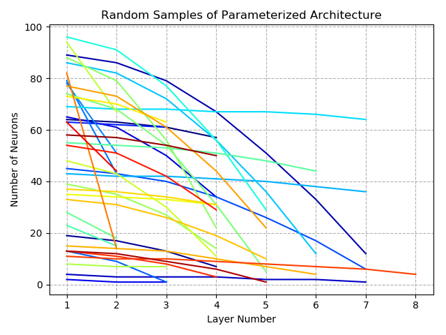

# Trigomatic
A submission for the very first [/r/ProgrammerHumor hackathon, Over Engineered](https://www.reddit.com/r/ProgrammerHumor/comments/ckhow3/the_very_first_programmerhumor_hackathon_is_now/) . In the future when humankind forgets the fundamentals of mathematics artificial intelligence will be used to calculate it for you. A custom genetic algorithm is used to optimize the architecture of a neural network such that it can accurately calculate basic trig functions for you.

## Requirements
`pip install -r requirements.txt` 
- Numpy
- Matplotlib
- TensorFlow (version > 2.0)

## Running an Example

1. open ipython
2. `run genetic_network.py`
```
usage: genetic_network.py [-h] [-e EPOCHS] [-p POPULATION] [-g GENERATIONS]

optional arguments:
  -h, --help            show this help message and exit
  -e EPOCHS, --epochs EPOCHS
                        Number of training epochs
  -p POPULATION, --population POPULATION
                        Initial population size
  -g GENERATIONS, --generations GENERATIONS
                        Number of generations
```

... let it train and breed, the best network will be saved to an h5py file

3. `run evaluate.py --angle 40`


## Training Data
Simulated data is used to train the neural network and custom data can be created using the function below
```python
def create_data(func, NUM=10000):
    X = np.random.choice( np.linspace(0,2*np.pi, NUM+1000), NUM, replace=False)
    y = func(X)
    return X.reshape(-1,1), y.reshape(-1,1)
```
Call the function like such: `create_data( np.cos, 10000)`

If you want to use a custom function, feel free but remember to change the range in which the function is evaluated. For the example above the data is evalulated between 0 and 2 pi, with 10000 random points inbetween. 

## Neural Network Architecture
TensorFlow is used to create a deep neural network that is eventually trained to compute a trig function. The class [`individual`](genetic_network.py) has properties that pertain to building a parameterized machine learning model, creating random architectures and breeding/swapping traits between models for the genetic algorithm optimization. The neural network architecture is parameterized using a cos function: 
```python
layer_func = lambda x, A,w: (A*np.cos(w*np.linspace(0,np.pi/2,x))).astype(int)
```
where *x* corresponds to the number of layers, *A* is the number of neurons in the first layer with all subsequent layers being smaller than that and *w* changes the rate of neural degradation. 50 random samples from an initial network population looks like this:



Each network has an input size of 1 corresponding to an angle and an output size of 1 corresponding to the respective trig function evaluation for that angle. 

## Genetic Algorithm
A genetic algorithm is used to explore the parameter space from which the neural networks are formed. Only a few traits are parameterized for each neural network: 
- `layer_size` - number of neurons per layer
- `batch_size` - number of samples per training update
- `learning_rate` - learning rate of [SGD](https://www.tensorflow.org/api_docs/python/tf/keras/optimizers/SGD)
- `momentum` - hyper parameter that accelerates SGD in the relevant direction and dampens oscillations
- `decay` - time inverse decay of learning rate
- `dropout` - rate of dropout after first layer

An example generating two random models and then breeding them to produce offspring:
```python
from genetic_network import individual
parent1 = individual.randomize()
parent2 = individual.randomize()
baby1, baby2 = individual.breed(parent1, parent2)
```
The genetic algorithm applies random [cross over](https://en.wikipedia.org/wiki/Crossover_(genetic_algorithm)) when swapping traits between generations. There is also a 1% [mutation rate](https://en.wikipedia.org/wiki/Mutation_(genetic_algorithm)) during breeding which causes the offspring to have between 1-3 traits randomized. For more information just read the [source code](genetic_network.py). The neural network associated with each individual can be viewed like such:
```ipython
In [10]: parent1.model.summary()                                                                                                                                                                                                                                                            
Model: "model_8"
_________________________________________________________________
Layer (type)                 Output Shape              Param #   
=================================================================
input (InputLayer)           [(None, 1)]               0         
_________________________________________________________________
dense_22 (Dense)             (None, 50)                100       
_________________________________________________________________
dense_23 (Dense)             (None, 42)                2142      
_________________________________________________________________
dropout_2 (Dropout)          (None, 42)                0         
_________________________________________________________________
dense_24 (Dense)             (None, 22)                946       
_________________________________________________________________
dense_25 (Dense)             (None, 1)                 23        
=================================================================
Total params: 3,211
Trainable params: 3,211
Non-trainable params: 0
_________________________________________________________________

In [11]: parent1.traits                                                                                                                                                                                                                                                                     
Out[11]: 
{'layer_sizes': array([ 50,  42,  22]),
 'batch_size': 54,
 'learning_rate': 0.2094,
 'momentum': 0.1181,
 'decay': 0.0033,
 'dropout': 0.1723}
```

## Future Applications
While this program was made as a joke, the optimization using a genetic algorithm is something that can be used in modern day research particularly if you can train a neural network in a reasonable amount of time. Then you can leverage this ensamble sampling technique to find the best architecture. 

I also wonder if a binary neural network could be optimized and ultimately replace the calculations a computer makes to compute trig functions on the lowest level? Like a neural network that just does bit operations 